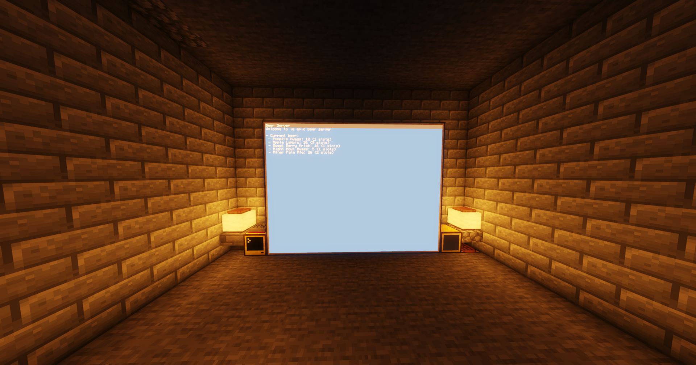

**development has been moved to: https://astolfo.uk/git/macbookairuser12/beer-cc**

# beer cc
A simple ME inspired storage system made for ComputerCraft.

***NOTE: THIS WAS MADE AND TESTED ON CC:TWEAKED 1.100.5 (Minecraft 1.18.2)***

# Installation
To install `beer-cc` just type the following command in your computer:
```bash
$ wget https://raw.githubusercontent.com/Autist69420/beer-cc/main/src/download.lua
```

# Images

## Server

